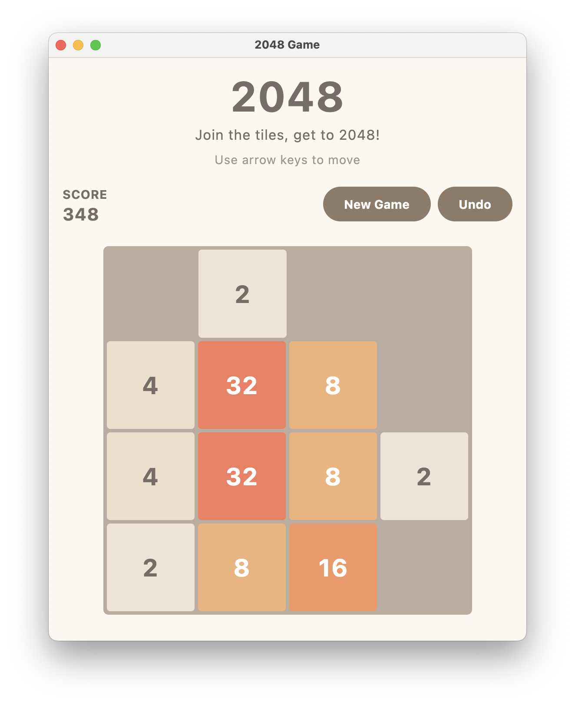

# 2048 Game

A modern implementation of the classic 2048 puzzle game, built with Kotlin and Jetbrains Compose for Desktop. This project demonstrates clean architecture principles and modern development practices in Kotlin.



## Features

- 🎮 Classic 2048 gameplay mechanics
- 🎨 Modern UI with Material 3 design
- ⌨️ Keyboard controls (Arrow keys or WASD)
- 🎯 Score tracking and game state management
- 💾 Game state persistence
- 🖼️ Smooth animations and transitions
- 📱 Responsive layout

## Technologies Used

- **Language**: Kotlin 1.9.20
- **UI Framework**: Jetbrains Compose for Desktop with Material 3
- **Async Operations**: Kotlin Coroutines
- **Testing**:
  - JUnit 5
  - Mockk for mocking
  - Coroutines Test
  - Kover for code coverage
- **Code Quality**:
  - ktlint for code formatting
  - detekt for static code analysis

## Getting Started

### Prerequisites

- JDK 21 or later
- Gradle 8.0 or later

### Installation

1. Clone the repository:
   ```bash
   git clone https://github.com/yourusername/2048.git
   cd 2048
   ```

2. Build the project:
   ```bash
   ./gradlew build
   ```

3. Run the application:
   ```bash
   ./gradlew run
   ```

## How to Play

1. Use arrow keys or WASD to move tiles
2. When two tiles with the same number touch, they merge into one
3. After each move, a new tile appears in a random empty spot
4. Create a tile with the number 2048 to win!
5. If you can't make a move, the game is over

## Development

This project follows clean architecture principles and Kotlin best practices. The codebase is organized into several key components:

- **Core Game Logic**: Handles game rules and mechanics
- **Game Engine**: Manages game state and processes moves
- **UI Layer**: Implements the user interface using Compose
- **Domain Models**: Defines the game's data structures

### Testing

Run the tests with:
```bash
./gradlew test
```

This will also generate a code coverage report in the `build/reports/kover/html` directory.

### Code Quality

The project uses several tools to maintain code quality:

- Run ktlint: `./gradlew ktlintCheck`
- Run detekt: `./gradlew detekt`

## License

This project is licensed under the MIT License - see the LICENSE file for details.